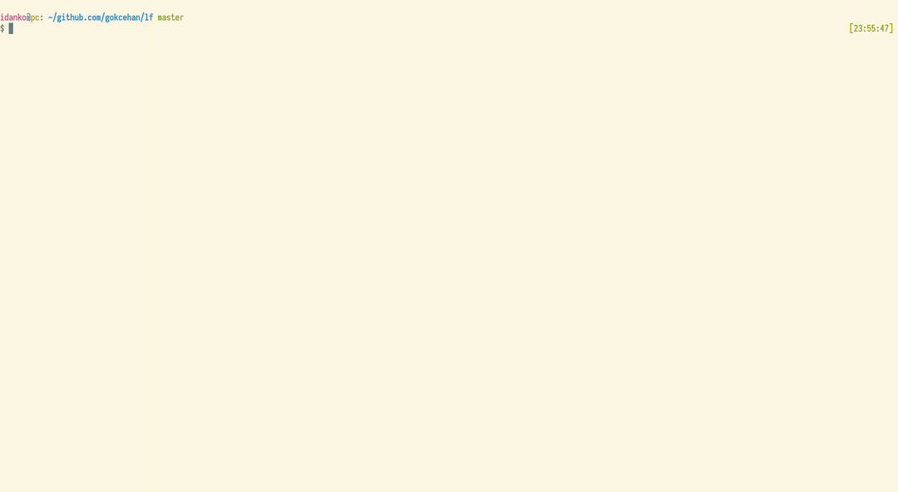

lf.vim
==========

Heavily inspired by [ranger.vim](https://github.com/francoiscabrol/ranger.vim)

[LF](https://github.com/gokcehan/lf) integration in vim and neovim



Installation
------------

Install it with your favorite plugin manager. Example with vim-plug:

        Plug 'idanko/lf.vim'

### Optional dependency

If you use neovim, you may want to add bclose.vim plugin (see a section below):

        Plug 'rbgrouleff/bclose.vim'

How to use it
-------------

The default shortcut for opening LF is `<leader>f` (\f by default)
To disable the default key mapping, add this line in your .vimrc or init.vim: `let g:lf_map_keys = 0`

then you can add a new mapping with this line: `map <leader>f :Lf<CR>`.

The command for opening LF in the current file's directory is `:Lf`.
Vim will open the selected file in the current window. To open the selected
file in a new tab instead use `:LfNewTab`.

For opening LF in the current workspace, run `:LfWorkingDirectory`.
Vim will open the selected file in the current window.
`:LfWorkingDirectoryNewTab` will open the selected file in a new tab instead.

List of commands:
```
Lf // open current file by default
LfCurrentFile // Default LF behaviour
LfCurrentDirectory
LfWorkingDirectory

// open always in new tabs
LfNewTab
LfCurrentFileNewTab
LfCurrentDirectoryNewTab
LfWorkingDirectoryNewTab

// open tab, when existant or in new tab when not existant
LfCurrentFileExistingOrNewTab
LfCurrentDirectoryExistingOrNewTab
LfWorkingDirectoryExistingOrNewTab
```

The old way to make vim open the selected file in a new tab was to add
`let g:lf_open_new_tab = 1` in your .vimrc or init.vim. That way is still
supported but deprecated.

### Opening LF instead of netrw when you open a directory
If you want to see vim opening LF when you open a directory (ex: nvim ./dir or :edit ./dir), please add this in your .(n)vimrc.
```
let g:NERDTreeHijackNetrw = 0 // add this line if you use NERDTree
let g:lf_replace_netrw = 1 // open LF when vim open a directory
```

In order for this to work you need to install the bclose.vim plugin (see above).

### Setting an other path for the temporary file
lf.vim uses a temporary file to store the path that was chosen, `/tmp/chosenfile` by default.
This can be a problem if you do not have write permissions for the `/tmp` directory, for example on Android.
There is a configuration variable for this called `g:lf_choice_file`, this must be set to the
path for a file that doesn't yet exist (this file is created when choosing a file and removed afterwards).

### Setting a custom LF command
By default LF is opened with the command `lf` but you can set an other custom command by setting the `g:lf_command_override` variable in your .(n)vimrc.

For instance if you want to display the hidden files by default you can write:
```
let g:lf_command_override = 'lf -command "set hidden"'
```

### Optional vim or nvim built-in terminal configuration
For the sake of saving screen estate you probably want to add a (TermOpen)TerminalOpen hook to your (n)vimrc like:
```
autocmd! TermOpen
autocmd  TermOpen * setlocal laststatus=0 noruler norelativenumber nonumber showtabline=0 signcolumn=no
      \| autocmd BufLeave <buffer> setlocal laststatus=2 ruler number relativenumber showtabline=2 signcolumn=yes
```
